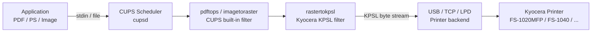
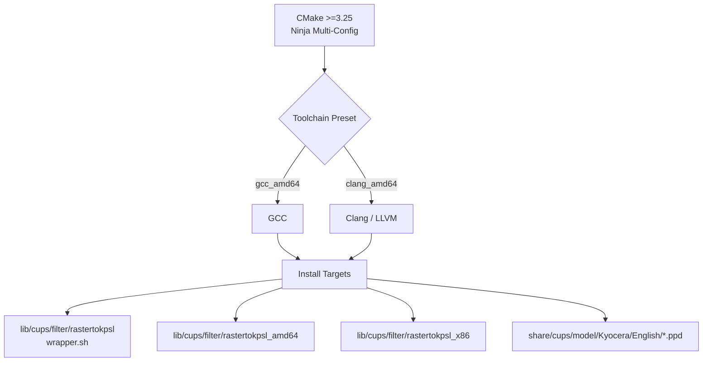

# kyocera_drivers

[](https://cmake.org/cmake/help/latest/release/3.25.html)
[](license)
[](https://www.kernel.org/)
[](https://www.openprinting.org/download/PPD/Kyocera/en/)

> CMake-based packaging and installation system for proprietary Kyocera CUPS drivers on Linux x86_64.

---

## Table of Contents

- [Overview](#overview)
- [Supported Models](#supported-models)
- [Prerequisites](#prerequisites)
- [Build & Install](#build--install)
- [Installation Components](#installation-components)
- [Uninstall](#uninstall)
- [Usage](#usage)
- [Troubleshooting](#troubleshooting)
- [Architecture](#architecture)
- [Notice](#notice)
- [References](#references)
- [License](#license)

---

## Overview

`kyocera_drivers` bundles proprietary Kyocera `rastertokpsl` filter binaries and legacy PPD files into a modern CMake install system for Linux CUPS environments.

**Note:** the previous open-source reverse-engineered implementation (`src/`) has been removed from this repository. This branch now serves exclusively as an installer and packaging layer for the manufacturer-provided binaries.

**Repository contents:**

- `proprietary/rastertokpsl_amd64` — x86_64 filter binary
- `proprietary/rastertokpsl_x86` — x86 filter binary
- `proprietary/wrapper.sh` — architecture-aware wrapper installed as `rastertokpsl`
- `ppd/English/` — bundled legacy PPD files
- `kyocera_drivers.desktop` — desktop integration entry
- `CMakePresets.json` — preset definitions for GCC and Clang

---

## Supported Models

Bundled PPD files support the following Kyocera printers:

| Model | Type |
|---|---|
| FS-1020MFP | GDI |
| FS-1025MFP | GDI |
| FS-1040 | GDI |
| FS-1060DN | GDI |
| FS-1120MFP | GDI |
| FS-1125MFP | GDI |

**Field tested:** FS-1020MFP

---

## Prerequisites

- Linux x86_64 distribution with CUPS
- `cmake` >= 3.25
- `ninja`
- `gcc` / `g++` or `clang` / `clang++`
- CUPS development headers

```bash
# Fedora
sudo dnf install cups-devel cmake ninja-build gcc g++

# Ubuntu / Debian
sudo apt install libcups2-dev cmake ninja-build gcc g++
```

---

## Build & Install

### Clone

```bash
git clone https://github.com/e-gleba/kyocera-drivers.git
cd kyocera-drivers
```

### Configure

```bash
# GCC (recommended)
cmake --preset gcc_amd64

# Clang / LLVM
cmake --preset clang_amd64
```

### Build

```bash
cmake --build --preset gcc_amd64
# or
cmake --build --preset clang_amd64
```

### Install

```bash
sudo cmake --install build/gcc_amd64 --prefix /usr
```

You may also build and install directly:

```bash
cmake --build build/gcc_amd64 --parallel
sudo cmake --install build/gcc_amd64 --prefix /usr
```

---

## Installation Components

CMake install components are available for selective deployment:

| Component | Description | Command |
|---|---|---|
| `proprietary_runtime` | filter binaries and wrapper | `cmake --install build/gcc_amd64 --component proprietary_runtime` |

PPD files install with the default (unspecified) component.

---

## Uninstall

CMake tracks installed files in `install_manifest.txt`.

```bash
cd build/gcc_amd64
sudo xargs rm -f < install_manifest.txt
```

If the `uninstall` target exists in your build tree:

```bash
sudo cmake --build . --target uninstall
```

---

## Usage

After installation, CUPS recognizes the bundled Kyocera PPDs. Add a printer via the CUPS web UI (`http://localhost:631`) or `lpadmin`, selecting the installed Kyocera driver.

---

## Troubleshooting

| Symptom | Resolution |
|---|---|
| Permission errors during install | Run with `sudo`. Ensure `/usr/share/cups/model/Kyocera` and `/usr/lib/cups/filter` are writable by root. |
| Missing dependencies during configure | Install `cups-devel` (Fedora) or `libcups2-dev` (Ubuntu). Verify `cmake` and `ninja` are on `PATH`. |
| Verbose build output | Append `--verbose` to the build command. |
| Filter runtime errors | Inspect `/var/log/cups/error_log` for CUPS-level diagnostics. |
| Incorrect page size or orientation | Ensure the selected PPD matches your exact printer model. |

---

## Architecture

### CUPS Filter Pipeline



### Build System Architecture



---

## Notice

Kyocera Document Solutions Inc. has transitioned to a universal driver model and cloud-centric print solutions. Legacy per-model PPD download endpoints are no longer maintained.

| Evidence | Source |
|---|---|
| Kyocera models supporting universal print | [KYOCERA — Universal Print](https://www.kyoceradocumentsolutions.com/support/universal_print/) |
| Global download portal (consolidated packages) | [KYOCERA Global Download](https://global.kyocera.com/support/download/) |
| Legacy PPD archive (OpenPrinting) | [OpenPrinting — Kyocera PPD Archive](https://www.openprinting.org/download/PPD/Kyocera/en/) |

Because upstream no longer maintains legacy download infrastructure, automated PPD fetching is disabled by default (`DOWNLOAD_PPDS=OFF`). The default build path uses the bundled `ppd/English/` directory.

---

## References

- [CMake — Installing and Testing](https://cmake.org/cmake/help/latest/guide/tutorial/Installing%20and%20Testing.html)
- [SDB: Using Your Own Filters to Print with CUPS](https://en.opensuse.org/SDB:Using_Your_Own_Filters_to_Print_with_CUPS)
- [KYOCERA — Models Supporting Universal Print](https://www.kyoceradocumentsolutions.com/support/universal_print/)
- [KYOCERA Global Download & Support Portal](https://global.kyocera.com/support/download/)
- [OpenPrinting — Kyocera PPD Archive](https://www.openprinting.org/download/PPD/Kyocera/en/)

---

## License

This project is licensed under the GNU General Public License v3.0. See [license](license) for the full text.
