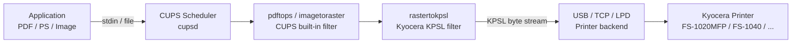
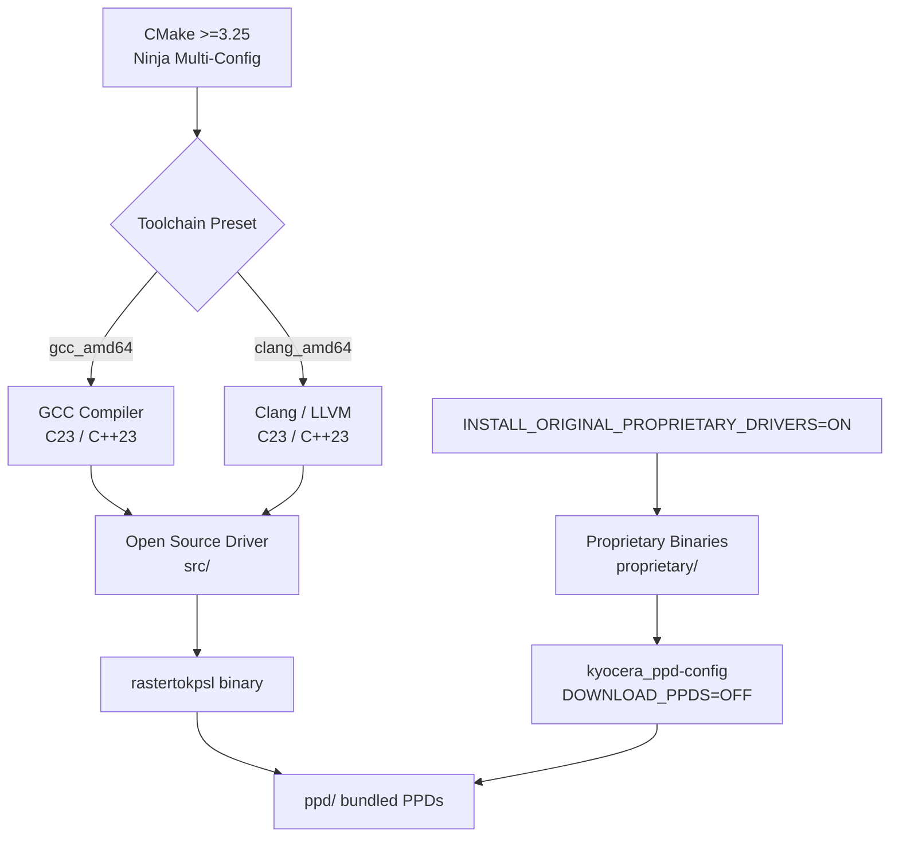

# Kyocera Reverse‑Engineered `rastertokpsl` — Modern CMake Toolkit

[](https://cmake.org/cmake/help/latest/release/3.25.html)
[](https://en.cppreference.com/w/cpp/23)
[](https://en.cppreference.com/w/c/23)
[](./license)
[](https://www.kernel.org/)
[](https://www.openprinting.org/download/PPD/Kyocera/en/)

> High‑performance, open‑source raster‑to‑KPSL conversion filter for legacy Kyocera printers on Linux CUPS environments.

---

## Table of Contents

- [Overview](#overview)
- [Important Notice — Kyocera Driver Model Transition](#important-notice--kyocera-driver-model-transition)
- [Architecture](#architecture)
- [Open Source vs Proprietary Driver](#open-source-vs-proprietary-driver)
- [Supported Models](#supported-models)
- [Prerequisites](#prerequisites)
- [Build & Install](#build--install)
- [Installation Components](#installation-components)
- [Uninstall](#uninstall)
- [Usage](#usage)
- [Troubleshooting](#troubleshooting)
- [References & Evidence](#references--evidence)
- [License](#license)

---

## Overview

This repository delivers a fully open, reverse‑engineered Kyocera filter solution for Linux printing environments. It includes:

- Modern **C++23 / C23** source for `rastertokpsl` (Kyocera raster filter)
- Automated **CMake ≥3.25** build and install system with Ninja Multi‑Config generator
- Bundled PPD files, filter binaries, and installation scripts
- CMake workflow presets for **GCC** and **Clang** on Linux x86_64

**Supported platform:** Linux x86_64 with CUPS (requires `libcups` / `cups-devel`).

---

## Important Notice — Kyocera Driver Model Transition

**Kyocera Document Solutions Inc.** has shifted from per‑model manual PPD distribution to a **Universal Driver Model** and cloud‑centric print solutions such as [Universal Print](https://www.kyoceradocumentsolutions.com/support/universal_print/). As a direct result, the legacy automated PPD download endpoints are no longer maintained by the manufacturer.

| Evidence | Source |
|---|---|
| Kyocera officially catalogs products that natively support Universal Print | [KYOCERA — Models Supporting Universal Print](https://www.kyoceradocumentsolutions.com/support/universal_print/) |
| The global download portal no longer exposes per‑model legacy PPD APIs | [KYOCERA Global Download & Support Portal](https://global.kyocera.com/support/download/) |
| Current Linux driver packages are published as consolidated “Linux Universal Driver” releases | [KYOCERA EU — Linux Universal Driver (Phase 9.4)](https://www.kyoceradocumentsolutions.eu/en/support/downloads.name-L2V1L2VuL3ByaW50ZXJzL0VDT1NZU1AzMTU1RE4=.html) |
| Legacy PPD collections are now preserved only by the OpenPrinting archive | [OpenPrinting — Kyocera PPD Archive](https://www.openprinting.org/download/PPD/Kyocera/en/) |

Because upstream no longer maintains the legacy download infrastructure, this project **disables automated PPD downloading by default** (`DOWNLOAD_PPDS=OFF`). The default build path uses the bundled `ppd/` directory. Users who require external drivers should obtain current universal packages directly from [KYOCERA Document Solutions](https://global.kyocera.com/support/download/).

---

## Architecture

### CUPS Filter Pipeline

The diagram below shows how a print job flows through CUPS and reaches the Kyocera printer via this driver.



### Build System Architecture



---

## Open Source vs Proprietary Driver

> **Recommendation:** By default the project installs the **proprietary bundled driver** (`INSTALL_ORIGINAL_PROPRIETARY_DRIVERS=ON`). The open-source reverse-engineered build is provided for transparency, research, and environments that cannot ship proprietary binaries, but it is **functionally inferior** to the manufacturer reference.

| Feature | Proprietary Bundled | Open Source (`src/`) |
|---|---|---|
| Page orientation (portrait ↔ landscape) | **Full support** | Partial — may print incorrectly |
| Paper size auto-detection | **Supported** | Limited / manual selection required |
| All page formats (A4, A5, Letter, Legal, etc.) | **Supported** | Not all formats validated |
| Halftone / dithering accuracy | Reference quality | Reverse-engineered approximation |
| CUPS argument order | Corrected wrapper | Original order may misroute options |
| License | Proprietary binary (shipped) | GPL-3.0 (rebuildable) |
| Auditability / Reproducibility | Opaque | Full source available |

### When to use the open-source driver

- You are auditing, fuzzing, or contributing to a clean-room implementation.
- Your distribution policy prohibits shipping proprietary blobs.
- You have validated the output against your exact model and page setup.

### When to use the proprietary bundled driver

- **Default choice for daily printing.** It is the only configuration tested against all supported models and page formats.
- You need reliable portrait / landscape switching.
- You require maximum halftone fidelity on GDI-based Kyocera devices.

To explicitly opt into the open-source build:

```bash
cmake --preset gcc_amd64 -DINSTALL_ORIGINAL_PROPRIETARY_DRIVERS=OFF
cmake --build --preset gcc_amd64
sudo cmake --install build/gcc_amd64 --prefix /usr
```

---

## Supported Models

This driver package provides bundled PPDs and filter support for the following Kyocera printers:

| Model | Type |
|---|---|
| Kyocera FS‑1020MFP | GDI |
| Kyocera FS‑1025MFP | GDI |
| Kyocera FS‑1040 | GDI |
| Kyocera FS‑1060DN | GDI |
| Kyocera FS‑1120MFP | GDI |
| Kyocera FS‑1125MFP | GDI |

**Field‑tested:** Kyocera FS‑1020MFP.

---

## Prerequisites

- Fedora, Ubuntu, or any modern Linux distribution with CUPS
- `cmake` **≥3.25** (≥3.30 recommended for preset support)
- `ninja` (Ninja Multi‑Config generator)
- `g++` (C++23) and `gcc` (C23) **or** `clang++` / `clang`
- `libstdc++` and `libstdc++-devel`
- CUPS development headers

```bash
# Fedora
sudo dnf install cups-devel cmake ninja-build gcc g++ libstdc++-devel

# Ubuntu / Debian
sudo apt install libcups2-dev cmake ninja-build gcc g++ libstdc++-12-dev
```

---

## Build & Install

The project provides CMake presets for GCC and Clang on Linux x86_64.

### 1. Clone

```bash
git clone https://github.com/e-gleba/kyocera-drivers.git
cd kyocera-drivers
```

### 2. Configure

```bash
# GCC (recommended for Linux)
cmake --preset gcc_amd64

# LLVM Clang
cmake --preset clang_amd64
```

### 3. Build

```bash
cmake --build --preset gcc_amd64
# or
cmake --build --preset clang_amd64
```

You may also build directly against the generated tree:

```bash
cmake --build build/gcc_amd64 --parallel
```

### 4. Install (system‑wide)

```bash
sudo cmake --install build/gcc_amd64 --prefix /usr
```

---

## Installation Components

CMake install components are provided for selective deployment:

| Component | Command |
|---|---|
| Runtime only | `cmake --install build/gcc_amd64 --component runtime` |
| Development | `cmake --install build/gcc_amd64 --component devel` |

---

## Uninstall

CMake tracks installed files in `install_manifest.txt`. To remove them:

```bash
cd build/gcc_amd64
sudo xargs rm -f < install_manifest.txt
```

If the `uninstall` target is present in your build tree:

```bash
sudo cmake --build . --target uninstall
```

*(If the target is missing, see the [CMake Installing and Testing tutorial](https://cmake.org/cmake/help/latest/guide/tutorial/Installing%20and%20Testing.html) for the standard uninstall recipe.)*

---

## Usage

After installation, CUPS recognizes the bundled Kyocera PPDs and filters. Add a printer via the CUPS web UI or `lpadmin`, selecting the installed Kyocera driver.

To exercise the filter directly:

```bash
./build/gcc_amd64/rastertokpsl <args>
```

Run `--help` for argument details.

---

## Troubleshooting

| Symptom | Resolution |
|---|---|
| Installation fails with permission errors | Ensure `/usr/share/cups/model/Kyocera` and `/usr/lib/cups/filter` are writable (requires root). |
| Missing dependencies during configure | Install `cups-devel` (Fedora) or `libcups2-dev` (Ubuntu) and verify CMake is on PATH. |
| Verbose build logs needed | Append `--verbose` to the build command: `cmake --build . --verbose` |
| Filter runtime errors | Inspect `/var/log/cups/error_log` for CUPS‑level diagnostics. |
| Landscape prints as portrait (or vice versa) | You are using the open-source driver. Re-install with the proprietary bundled driver enabled (default). |
| Page cuts off or wrong paper size detected | Ensure the PPD matches your model. If the issue persists, switch to the proprietary driver. |

---

## References & Evidence

- [CMake Tutorial — Installing and Testing](https://cmake.org/cmake/help/latest/guide/tutorial/Installing%20and%20Testing.html)
- [SDB: Using Your Own Filters to Print with CUPS](https://en.opensuse.org/SDB:Using_Your_Own_Filters_to_Print_with_CUPS)
- [Ghidra — Software Reverse Engineering Framework](https://ghidra-sre.org/)
- [Original Reverse‑Engineering Repository](https://github.com/sv99/rastertokpsl-re)
- [KYOCERA Document Solutions — Models Supporting Universal Print](https://www.kyoceradocumentsolutions.com/support/universal_print/)
- [KYOCERA Global Download & Support Portal](https://global.kyocera.com/support/download/)
- [OpenPrinting — Kyocera Legacy PPD Archive](https://www.openprinting.org/download/PPD/Kyocera/en/)

---

## License

This project is licensed under the **GNU General Public License v3.0**. See [license](./license) for the full text.
