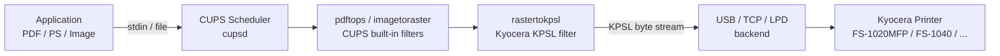
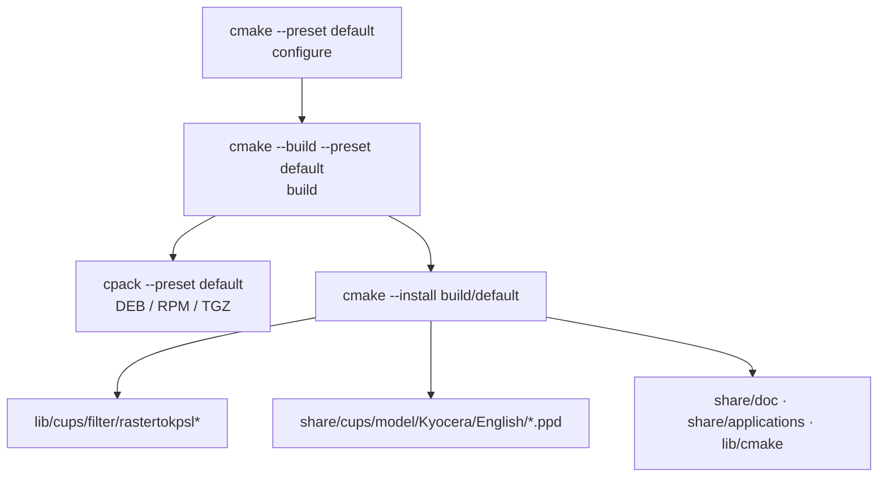

# kyocera_drivers

[](https://github.com/e-gleba/kyocera-drivers/actions/workflows/package.yml)
[](https://github.com/e-gleba/kyocera-drivers/releases/latest)
[](https://cmake.org/cmake/help/latest/release/3.31.html)
[](license)
[](https://www.kernel.org/)
[](https://www.openprinting.org/download/PPD/Kyocera/en/)

> CMake packaging and installation system for proprietary Kyocera CUPS drivers on Linux x86_64.

---

## Table of Contents

- [Overview](#overview)
- [Supported Models](#supported-models)
- [Requirements](#requirements)
- [Quick Start](#quick-start)
- [CMake Presets](#cmake-presets)
- [Install](#install)
- [Packaging](#packaging)
- [Uninstall](#uninstall)
- [Usage](#usage)
- [Troubleshooting](#troubleshooting)
- [Architecture](#architecture)
- [Notice](#notice)
- [References](#references)
- [License](#license)

---

## Overview

`kyocera_drivers` bundles the proprietary Kyocera `rastertokpsl` filter binaries and legacy PPD files into a modern CMake install system for Linux CUPS environments.

This project contains **no compiled code** — it is a pure packaging layer:

| Path | Description |
|---|---|
| `proprietary/rastertokpsl_amd64` | x86_64 filter binary |
| `proprietary/rastertokpsl_x86` | x86 filter binary |
| `proprietary/wrapper.sh.in` | Architecture-aware wrapper, configured at build time and installed as `rastertokpsl` |
| `ppd/English/` | Bundled legacy PPD files |
| `package/` | Desktop entry, icon and CPack metadata |
| `CMakePresets.json` | Single `default` preset chain: configure → build → package |

---

## Supported Models

Bundled PPD files support the following Kyocera printers:

| Model | Type |
|---|---|
| FS-1020MFP | GDI |
| FS-1025MFP | GDI |
| FS-1040 | GDI |
| FS-1060DN | GDI |
| FS-1120MFP | GDI |
| FS-1125MFP | GDI |

**Field tested:** FS-1020MFP

---

## Requirements

- Linux x86_64 with CUPS
- CMake ≥ 3.31 (preset schema version 9)
- Ninja

```bash
# Fedora
sudo dnf install cmake ninja-build cups

# Debian / Ubuntu
sudo apt install cmake ninja-build cups
```

---

## Quick Start

```bash
git clone https://github.com/e-gleba/kyocera-drivers.git
cd kyocera-drivers

cmake --workflow --preset default             # configure → build → package
sudo cmake --install build/default --prefix /usr
```

---

## CMake Presets

All operations are driven by a single `default` preset defined in [`CMakePresets.json`](CMakePresets.json). Run `cmake --list-presets` to discover what's available.

| Preset | Type | Command | Description |
|---|---|---|---|
| `default` | configure | `cmake --preset default` | Ninja generator, `Release`, build dir `build/default/` |
| `default` | build | `cmake --build --preset default` | No compilation — stages filters and PPDs |
| `default` | package | `cpack --preset default` | Generates DEB, RPM and TGZ into `build/default/` |
| `default` | workflow | `cmake --workflow --preset default` | configure → build → package in one shot |

---

## Install

```bash
sudo cmake --install build/default --prefix /usr
```

Install layout (relative to prefix):

| Destination | Contents |
|---|---|
| `lib/cups/filter/` | `rastertokpsl` wrapper plus `rastertokpsl_amd64` / `rastertokpsl_x86` |
| `share/cups/model/Kyocera/English/` | PPD files |
| `share/doc/kyocera_drivers/` | readme, license, package description |
| `share/applications/`, `share/pixmaps/` | desktop entry, icon |
| `lib/cmake/kyocera_drivers/` | package config — enables `find_package(kyocera_drivers CONFIG REQUIRED)` |

---

## Packaging

Packages are produced by the `default` package preset (CPack generators: DEB, RPM, TGZ):

```bash
cpack --preset default
# artifacts land in build/default/
```

Install the resulting package:

```bash
# Debian / Ubuntu
sudo dpkg -i build/default/kyocera_drivers-*-Linux.deb

# Fedora / ALT Linux / other RPM-based distros
sudo rpm -i build/default/kyocera_drivers-*-Linux.rpm
```

CI builds packages on every push and PR. Releases are fully automated: push a tag `v*.*.*` and the [release workflow](.github/workflows/release.yml) builds packages, generates release notes and attaches `.deb`, `.rpm` and `.tar.gz` assets.

---

## Uninstall

If installed via `cmake --install`:

```bash
cd build/default
sudo xargs rm -f < install_manifest.txt
```

If installed from a package:

```bash
sudo dpkg -r kyocera_drivers   # DEB
sudo rpm -e kyocera_drivers    # RPM
```

---

## Usage

Restart CUPS after installation, then add the printer via the web UI (`http://localhost:631`) or `lpadmin`, selecting the installed Kyocera PPD:

```bash
sudo systemctl restart cups
```

---

## Troubleshooting

| Symptom | Resolution |
|---|---|
| Permission errors during install | Run with `sudo`; ensure `/usr/share/cups/model/Kyocera` and `/usr/lib/cups/filter` are writable by root |
| Preset errors on configure | Preset schema version 9 requires CMake ≥ 3.31 — check `cmake --version` |
| Missing tools during configure | Verify `cmake` and `ninja` are on `PATH` |
| Filter runtime errors | Inspect `/var/log/cups/error_log` for CUPS-level diagnostics |
| Wrong page size or orientation | Selected PPD must match the exact printer model |

---

## Architecture

### CUPS filter pipeline


```mermaid
flowchart LR
    A[Application<br>PDF / PS / Image] -->|stdin / file| B[CUPS Scheduler<br>cupsd]
    B --> C[pdftops / imagetoraster<br>CUPS built-in filters]
    C --> D[rastertokpsl<br>Kyocera KPSL filter]
    D -->|KPSL byte stream| E[USB / TCP / LPD<br>backend]
    E --> F[Kyocera Printer<br>FS-1020MFP / FS-1040 / ...]
```

### Build system


```mermaid
flowchart TD
    A[cmake --preset default<br>configure] --> B[cmake --build --preset default<br>build]
    B --> C[cpack --preset default<br>DEB / RPM / TGZ]
    B --> D[cmake --install build/default]
    D --> E[lib/cups/filter/rastertokpsl*]
    D --> F[share/cups/model/Kyocera/English/*.ppd]
    D --> G[share/doc · share/applications · lib/cmake]
```

---

## Notice

Kyocera Document Solutions Inc. has transitioned to a universal driver model and cloud-centric print solutions. Legacy per-model PPD download endpoints are no longer maintained.

| Evidence | Source |
|---|---|
| Kyocera models supporting universal print | [KYOCERA — Universal Print](https://www.kyoceradocumentsolutions.com/support/universal_print/) |
| Global download portal (consolidated packages) | [KYOCERA Global Download](https://global.kyocera.com/support/download/) |
| Legacy PPD archive (OpenPrinting) | [OpenPrinting — Kyocera PPD Archive](https://www.openprinting.org/download/PPD/Kyocera/en/) |

Because upstream no longer maintains legacy download infrastructure, automated PPD fetching is disabled by default (`DOWNLOAD_PPDS=OFF`). The default build path uses the bundled `ppd/English/` directory.

---

## References

- [CMake — Presets](https://cmake.org/cmake/help/latest/manual/cmake-presets.7.html)
- [CMake — Installing and Testing](https://cmake.org/cmake/help/latest/guide/tutorial/Installing%20and%20Testing.html)
- [SDB: Using Your Own Filters to Print with CUPS](https://en.opensuse.org/SDB:Using_Your_Own_Filters_to_Print_with_CUPS)
- [OpenPrinting — Kyocera PPD Archive](https://www.openprinting.org/download/PPD/Kyocera/en/)

---

## License

This project is licensed under the GNU General Public License v3.0. See [license](license) for the full text.
