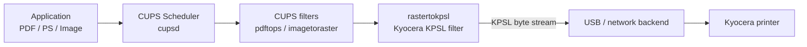

<div align="center">

# kyocera_drivers

[](https://github.com/e-gleba/kyocera-drivers/actions/workflows/package.yml)
[](https://github.com/e-gleba/kyocera-drivers/releases/latest)
[](https://github.com/e-gleba/kyocera-drivers)
[](https://github.com/e-gleba/kyocera-drivers)

[](https://github.com/e-gleba/kyocera-drivers/actions/workflows/package.yml)
[](https://github.com/e-gleba/kyocera-drivers/actions/workflows/release.yml)

Proprietary Kyocera `rastertokpsl` filter and legacy PPDs, packaged for modern Linux CUPS. No compiled code — CMake/CPack packaging only. Linux x86_64.

**Supported:** FS-1020MFP · FS-1025MFP · FS-1040 · FS-1060DN · FS-1120MFP · FS-1125MFP (GDI).

</div>

---

## Install

Prebuilt `.deb`, `.rpm` and `.tar.gz` are attached to [every release](https://github.com/e-gleba/kyocera-drivers/releases/latest):

```bash
sudo dpkg -i kyocera_drivers-*-Linux.deb   # Debian / Ubuntu
sudo rpm -i kyocera_drivers-*-Linux.rpm    # Fedora / ALT Linux
```

From source — requires `cmake` ≥ 3.31, `ninja`, `cups`:

```bash
git clone https://github.com/e-gleba/kyocera-drivers.git
cd kyocera-drivers
cmake --preset default -DCMAKE_INSTALL_PREFIX=/usr
sudo cmake --install build/default --prefix=/usr
```

Either way, finish with:

```bash
sudo systemctl restart cups
ls /usr/lib/cups/filter/rastertokpsl*   # verify: wrapper + both binaries present
```

Then add the printer at <http://localhost:631> and select the Kyocera PPD matching your exact model.

## Uninstall

```bash
sudo xargs rm -f < build/default/install_manifest.txt   # installed from source
sudo dpkg -r kyocera_drivers                            # installed from .deb
sudo rpm -e kyocera_drivers                             # installed from .rpm
```

## How It Works


```mermaid
flowchart LR
    A[Application<br>PDF / PS / Image] --> B[CUPS Scheduler<br>cupsd]
    B --> C[CUPS filters<br>pdftops / imagetoraster]
    C --> D[rastertokpsl<br>Kyocera KPSL filter]
    D -->|KPSL byte stream| E[USB / network backend]
    E --> F[Kyocera printer]
```

## Troubleshooting

| Symptom | Fix |
|---|---|
| `rastertokpsl_amd64: No such file or directory`, filter stops with status 127 | Stale wrapper from an older release. `sudo rm -f /usr/lib/cups/filter/rastertokpsl* /usr/local/lib/cups/filter/rastertokpsl*`, then reinstall. |
| `No such preset "default"` | CMake ≥ 3.31 required — check `cmake --version`. |
| Filter errors at runtime | `sudo tail -f /var/log/cups/error_log` |
| Wrong page size or orientation | Selected PPD does not match the exact printer model. |

---

## Known Upstream Problems

The issues below live in the external printing stack (Kyocera's proprietary binary, CUPS defaults, libcupsfilters) — **not** in this packaging layer. Each entry has a minimal reproducer so you can check whether you are affected before opening an issue here.

Before anything else, enable debug logging and watch a job's full lifecycle — the log names the exact filter that fails:

```bash
sudo cupsctl --debug-logging && sudo systemctl restart cups
sudo tail -F /var/log/cups/error_log | grep --line-buffered -E '\[Job'
```

### 1. Printer hangs mid-job until power cycle — proprietary filter crashes on non-ASCII job titles

Kyocera's `rastertokpsl` binary aborts (SIGABRT/SIGSEGV) when the job title or username contains non-ASCII characters (e.g. Cyrillic on `ru_RU.UTF-8` systems). The printer receives a partial KPSL stream and waits in "Processing" forever — only a power cycle recovers it. Windows is unaffected (different driver codebase).

```bash
# reproduce
lp -d <queue> -t "тест" /usr/share/cups/data/testprint

# check
sudo grep -E 'crashed|signal' /var/log/cups/error_log
# → "rastertokpsl) crashed on signal 11" or "stopped with status 1"
```

**Fix:** replace the proprietary filter with the reverse-engineered open-source [rastertokpsl-re](https://github.com/Fe-Ti/rastertokpsl-re) (packaged in ALT Linux Sisyphus as `rastertokpsl-re`; installs over `/usr/lib/cups/filter/rastertokpsl`).

> [!NOTE]
> The bundled `wrapper.sh` sanitizes the job title, but `[[:alnum:]]` also matches Cyrillic letters in UTF-8 locales — full protection requires forcing `LC_ALL=C` in the wrapper. The crash itself is in Kyocera's binary, not the wrapper.

References: [rastertokpsl-re](https://github.com/Fe-Ti/rastertokpsl-re) · [OpenPrinting/cups#966](https://github.com/OpenPrinting/cups/issues/966) · [Arch forums — FS-1061DN filter crash](https://bbs.archlinux.org/viewtopic.php?id=272961)

### 2. Queue shows "stopped" after any failed job — CUPS default error policy

CUPS ships with the `stop-printer` error policy: one failed filter halts the entire queue and every later job piles up behind it.

```bash
# check
lpstat -p <queue>     # printer shows as stopped/disabled

# fix
sudo lpadmin -p <queue> -o printer-error-policy=abort-job
```

Reference: [Arch Wiki — CUPS/Troubleshooting](https://wiki.archlinux.org/title/CUPS/Troubleshooting)

### 3. Every job fails with "Unexpected page count" — libcupsfilters 2.2.1 pdfio regression

libcupsfilters 2.2.1 replaced qpdf with pdfio; the new page-count code in `cfFilterGhostscript` misreads its own intermediate PDF (`Missing Root object`) and aborts **every** job — PDF, PostScript, and test pages alike — before any data reaches the printer. Affects all `*cupsFilter`-based drivers, not just Kyocera. Fixed upstream by [PR #167](https://github.com/OpenPrinting/libcupsfilters/pull/167).

```bash
# reproduce
lp -d <queue> any.pdf

# check
sudo grep -E 'Missing Root object|Unexpected page count' /var/log/cups/error_log
rpm -q libcupsfilters    # affected: 2.2.1 with pdfio 1.6.4; 2.1.1 with qpdf is fine
```

**Fix:** update libcupsfilters to a build containing the PR #167 fix, or downgrade to 2.1.1.

Reference: [OpenPrinting/libcupsfilters#209](https://github.com/OpenPrinting/libcupsfilters/issues/209)

---

## Notice

Kyocera has moved to a universal driver and cloud print model and no longer maintains legacy per-model PPD downloads ([Universal Print](https://www.kyoceradocumentsolutions.com/support/universal_print/), [global portal](https://global.kyocera.com/support/download/)). This repo therefore bundles the PPDs from the [OpenPrinting archive](https://www.openprinting.org/download/PPD/Kyocera/en/) in `ppd/English/`; automated fetching is disabled by default (`DOWNLOAD_PPDS=OFF`).

---

<div align="center">

[CMake Presets](https://cmake.org/cmake/help/latest/manual/cmake-presets.7.html) · [CPack](https://cmake.org/cmake/help/latest/module/CPack.html) · [SDB: Custom CUPS Filters](https://en.opensuse.org/SDB:Using_Your_Own_Filters_to_Print_with_CUPS) · [rastertokpsl-re](https://github.com/Fe-Ti/rastertokpsl-re)

GPL-3.0 — see [license](license).

</div>
