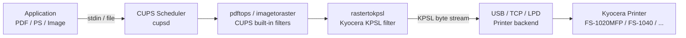
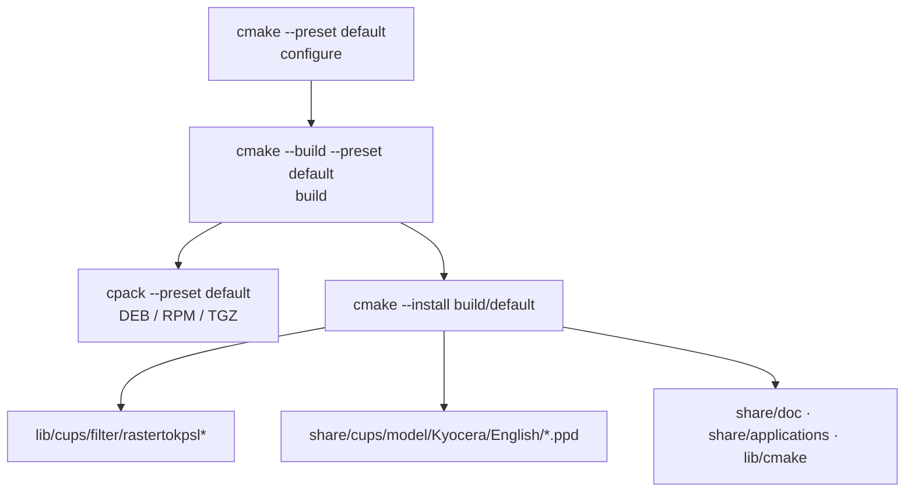

# kyocera_drivers

[](https://github.com/e-gleba/kyocera-drivers/actions/workflows/package.yml)
[](https://github.com/e-gleba/kyocera-drivers/releases/latest)
[](https://cmake.org/cmake/help/latest/release/3.31.html)
[](license)
[](https://www.kernel.org/)
[](https://www.openprinting.org/download/PPD/Kyocera/en/)

> CMake packaging and installation system for proprietary Kyocera CUPS drivers on Linux x86_64.

---

## Overview

`kyocera_drivers` bundles the proprietary Kyocera `rastertokpsl` filter binaries and legacy PPD files into a modern CMake install system for Linux CUPS environments.

This project contains **no compiled code** — it is a pure packaging layer:

- `proprietary/rastertokpsl_amd64` — x86_64 filter binary
- `proprietary/rastertokpsl_x86` — x86 filter binary
- `proprietary/wrapper.sh` — architecture-aware wrapper (installed as `rastertokpsl`; resolves the filter binary relative to its own location at runtime, so it works under any install prefix)
- `ppd/English/` — bundled legacy PPD files
- `package/kyocera_drivers.desktop` — desktop integration entry
- `CMakePresets.json` — `default` preset chain: configure → build → package

---

## Supported Models

Bundled PPD files support the following Kyocera printers:

| Model | Type |
|---|---|
| FS-1020MFP | GDI |
| FS-1025MFP | GDI |
| FS-1040 | GDI |
| FS-1060DN | GDI |
| FS-1120MFP | GDI |
| FS-1125MFP | GDI |

**Field tested:** FS-1020MFP

---

## Prerequisites

- Linux x86_64 distribution with CUPS
- `cmake` >= 3.31
- `ninja`

```bash
# Fedora
sudo dnf install cmake ninja-build cups

# Ubuntu / Debian
sudo apt install cmake ninja-build cups
```

---

## Build & Install

### Clone

```bash
git clone https://github.com/e-gleba/kyocera-drivers.git
cd kyocera-drivers
```

### Configure

```bash
cmake --preset default
```

To install system-wide under `/usr` (recommended — on most distributions CUPS
only searches `/usr/lib/cups/filter`), set the prefix at **configure time**:

```bash
cmake --preset default -DCMAKE_INSTALL_PREFIX=/usr
```

### Build

Nothing is compiled (the project is `LANGUAGES NONE`) — this step is a no-op
kept for preset uniformity:

```bash
cmake --build --preset default
```

### Install

```bash
sudo cmake --install build/default
```

The `rastertokpsl` wrapper locates the real filter binary relative to itself
at runtime, so overriding the destination at install time is also safe:

```bash
sudo cmake --install build/default --prefix /usr
```

Verify the installation — wrapper and binaries must sit side by side:

```bash
ls -l /usr/lib/cups/filter/rastertokpsl*
grep '^exec' /usr/lib/cups/filter/rastertokpsl
```

### Workflow

Configure → build → package in one shot:

```bash
cmake --workflow --preset default
```

---

## Packaging

DEB, RPM and TGZ packages are generated via CPack:

```bash
cpack --preset default
# packages appear in build/default/
```

Install the resulting package:

```bash
# Debian / Ubuntu
sudo dpkg -i build/default/kyocera_drivers-*-Linux.deb

# Fedora / ALT Linux / other RPM-based distros
sudo rpm -i build/default/kyocera_drivers-*-Linux.rpm
```

CI builds packages on every push and PR.

Releases are fully automated: push a tag `v*.*.*` and the [release workflow](.github/workflows/release.yml) builds packages, generates release notes and attaches `.deb`, `.rpm` and `.tar.gz` as assets.

---

## Uninstall

If installed via `cmake --install`:

```bash
cd build/default
sudo xargs rm -f < install_manifest.txt
```

If installed from a package:

```bash
sudo dpkg -r kyocera_drivers   # DEB
sudo rpm -e kyocera_drivers    # RPM
```

---

## Usage

Restart CUPS after installation, then add the printer via the CUPS web UI (`http://localhost:631`) or `lpadmin`, selecting the installed Kyocera PPD:

```bash
sudo systemctl restart cups
```

---

## Troubleshooting

| Symptom | Resolution |
|---|---|
| Permission errors during install | Run with `sudo`. Ensure `/usr/share/cups/model/Kyocera` and `/usr/lib/cups/filter` are writable by root. |
| `rastertokpsl_amd64: No such file or directory`, filter stops with status 127 | A stale wrapper from an older release is on disk (it hardcoded the configure-time prefix). Remove old copies with `sudo rm -f /usr/lib/cups/filter/rastertokpsl* /usr/local/lib/cups/filter/rastertokpsl*`, then reinstall. |
| `No such preset "default"` | Preset schema version 9 requires CMake >= 3.31. Check `cmake --version` and run `cmake --list-presets` to see available presets. |
| Missing dependencies during configure | Verify `cmake` and `ninja` are on `PATH`. |
| Filter runtime errors | Inspect `/var/log/cups/error_log` for CUPS-level diagnostics. |
| Incorrect page size or orientation | Ensure the selected PPD matches your exact printer model. |

---

## Architecture

### CUPS Filter Pipeline


```mermaid
flowchart LR
    A[Application<br>PDF / PS / Image] -->|stdin / file| B[CUPS Scheduler<br>cupsd]
    B --> C[pdftops / imagetoraster<br>CUPS built-in filters]
    C --> D[rastertokpsl<br>Kyocera KPSL filter]
    D -->|KPSL byte stream| E[USB / TCP / LPD<br>Printer backend]
    E --> F[Kyocera Printer<br>FS-1020MFP / FS-1040 / ...]
```

### Build System


```mermaid
flowchart TD
    A[cmake --preset default<br>configure] --> B[cmake --build --preset default<br>build]
    B --> C[cpack --preset default<br>DEB / RPM / TGZ]
    B --> D[cmake --install build/default]
    D --> E[lib/cups/filter/rastertokpsl*]
    D --> F[share/cups/model/Kyocera/English/*.ppd]
    D --> G[share/doc · share/applications · lib/cmake]
```

---

## Notice

Kyocera Document Solutions Inc. has transitioned to a universal driver model and cloud-centric print solutions. Legacy per-model PPD download endpoints are no longer maintained.

| Evidence | Source |
|---|---|
| Kyocera models supporting universal print | [KYOCERA — Universal Print](https://www.kyoceradocumentsolutions.com/support/universal_print/) |
| Global download portal (consolidated packages) | [KYOCERA Global Download](https://global.kyocera.com/support/download/) |
| Legacy PPD archive (OpenPrinting) | [OpenPrinting — Kyocera PPD Archive](https://www.openprinting.org/download/PPD/Kyocera/en/) |

Because upstream no longer maintains legacy download infrastructure, automated PPD fetching is disabled by default (`DOWNLOAD_PPDS=OFF`). The default build path uses the bundled `ppd/English/` directory.

---

## References

- [CMake — Presets](https://cmake.org/cmake/help/latest/manual/cmake-presets.7.html)
- [CMake — Installing and Testing](https://cmake.org/cmake/help/latest/guide/tutorial/Installing%20and%20Testing.html)
- [SDB: Using Your Own Filters to Print with CUPS](https://en.opensuse.org/SDB:Using_Your_Own_Filters_to_Print_with_CUPS)
- [KYOCERA — Models Supporting Universal Print](https://www.kyoceradocumentsolutions.com/support/universal_print/)
- [KYOCERA Global Download & Support Portal](https://global.kyocera.com/support/download/)
- [OpenPrinting — Kyocera PPD Archive](https://www.openprinting.org/download/PPD/Kyocera/en/)

---

## License

This project is licensed under the GNU General Public License v3.0. See [license](license) for the full text.
